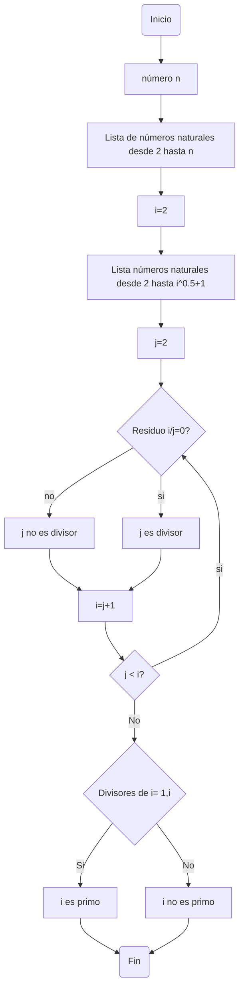

# Diagramitas_y_pseudocodiguitos
He aquí el repo del  RETO#4
# Ejercicio Números Primos 
Lo primero que hice fue escribir los pasos que quería seguir para crear el pseudocódigo: 
- Inicio 
- PASO 1. Crear una lista de números naturales desde 2 hasta n
- PASO 2. Repetir para cada número i de la lista 
- PASO 2.1. Crear una lista de números naturales desde 2 hasta (i^0.5)+1
- PASO 2.2. Repetir para cada número j de la lista 
- PASO 2.3. Dividir i sobre j 
- PASO 2.4. Si el residuo de la división es cero, j es divisor 
- PASO 2.5. Sino, j no es divisor 
- PASO 3. Si los divisores de i son {1; i}, i es primo 
- PASO 3.1. Sino, i no es primo 
- Fin 

Despues escribí el código en bloc de notas y quedó asi:
```pseudocode
  [variables]
n : entero
i : entero
j : entero
 inicio
j := 2
Mientras (j < i) hacer
  Si 
   Mientras modulo (i,j) == 0 hacer
    modulo (i,j) == 0 entonces
      j <- divisor de i
      j := j+1
   Fin mientras
  sino 
   Mientras (divisores de i : i , 1) hacer 
    escribir("i son los números primos hasta n")
 Fin mientras
  Fin
```
Y por último hice el diagrama de flujo en mermaid y quedó asi:

# Ejercicio Raices cuadradas 
Tengo que admitir que etse ejercicio estuvo un más complejo.

